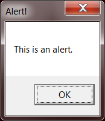
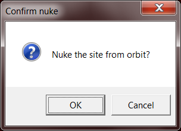

.. default-role:: code
====================
Native Message Boxes
====================

In addition to displaying message boxes using Python's built-in TkInter GUI toolkit, PyMsgBox also has limited support for displaying message boxes by calling the operating system's native functions. These exist in the `native` module. To use them, call:

    >>> import pymsgbox
    >>> pymsgbox.native.alert('This is an alert.', 'The title.')

Or, to avoid changing your function calls to use pymsgbox.native, run:

    >>> import pymsgbox.native as pymsgbox

Support
=======

These are the platforms and functions that have native message box support. Functions that do are not supported will default back to the normal TkInter-based message box.

Support as of v1.0.1:

+-------------+---------+---------+---------+--------------+
|             | Windows | OS X    | Linux   | JVM / Jython |
+-------------+---------+---------+---------+--------------+
| `alert()`   | Yes     | No      | No      | No           |
+-------------+---------+---------+---------+--------------+
| `confirm()` | Yes     | No      | No      | No           |
+-------------+---------+---------+---------+--------------+
| `prompt()`  | No      | No      | No      | No           |
+-------------+---------+---------+---------+--------------+
|`password()` | No      | No      | No      | No           |
+-------------+---------+---------+---------+--------------+

Special Notes
=============

Windows - alert()
-----------------

The message box will only show a button with text "OK", no matter what is passed for the `button` argument. The `button` argument will be the text that is returned by the function, just like the TkInter `alert()`.

>>> pymsgbox.native.alert('This is an alert.', 'Alert!')
'OK'

Windows - confirm()
-------------------

There will only be buttons "OK" and "Cancel", no matter what is passed for the `buttons` argument. If "OK" is clicked, the first item in the `buttons` list is returned (by default, this is `'OK'`). If "Cancel" is clicked, the second item in the `buttons` list is returned (by default, this is `'Cancel'`), just like the TkInter `confirm()`.

>>> pymsgbox.native.confirm('Nuke the site from orbit?', 'Confirm nuke', ["Yes, I'm sure.", 'Cancel'])
"Yes, I'm sure."

